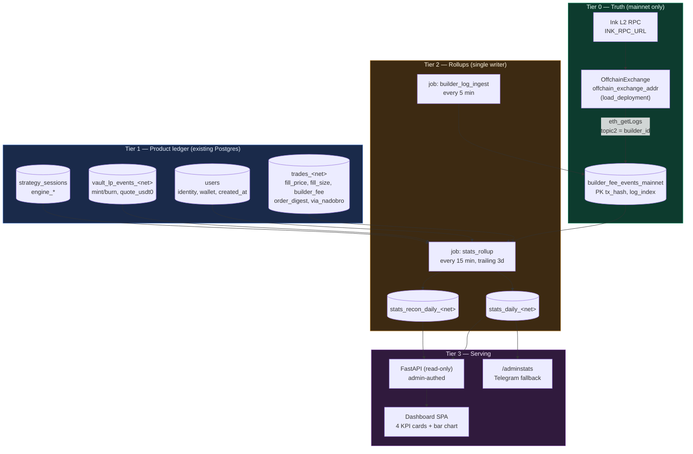
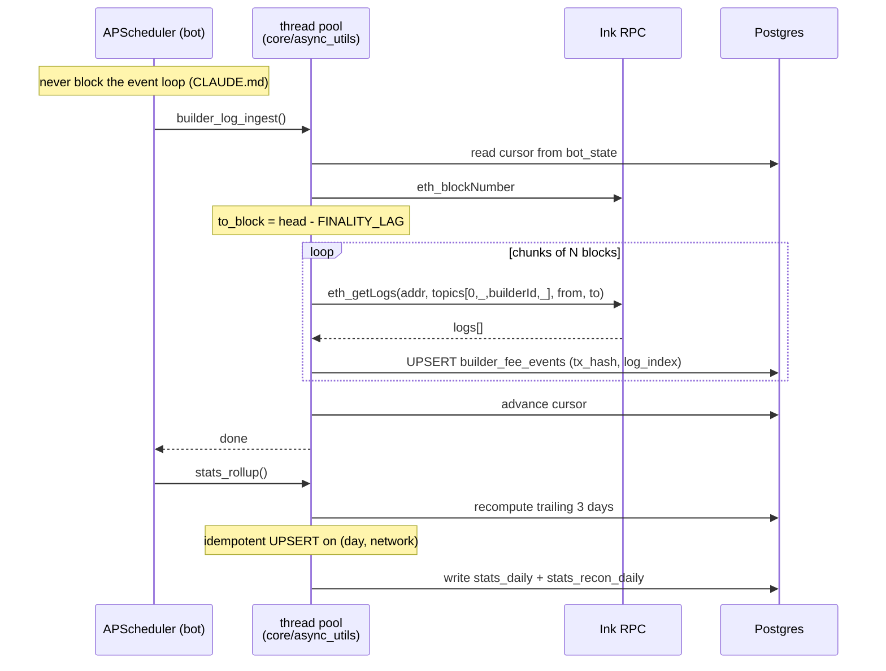

# Nadobro Stats Dashboard — Execution Architecture

**Status:** design / pre-implementation. No code written yet.
**Scope:** Total Transactions (bar chart), Total Volume, Total Users, NLP Deposits.

Every capability claim below was verified against the live Nado docs (2026-08-01), the pinned
`nado-protocol==0.3.3` SDK in `.venv`, and this repo's schema. Claims I could **not** verify are
listed explicitly in [§7 Verification ladder](#7-verification-ladder) as things to prove before
building, not assumed.

---

## 1. The premise correction (read this first)

> "We should be able to pull the stats from Nado builder profile using the builder code."

**There is no builder stats API, and there is no builder profile.** I read the complete docs index
(`docs.nado.xyz/llms.txt`) — gateway queries, archive/indexer, v2 REST, subscriptions. There is no
builder-scoped analytics endpoint anywhere. The builder integration surface is exactly four things:

| Surface | What it gives | Verified |
|---|---|---|
| Order `appendix` bits 48–63 / 38–47 | Route an order under our builder ID + fee rate | ✅ we already do this — `venue/nado_client.py:2475`, `config.py:304` |
| `getBuilder(builderId)` | owner, default fee tier, lowest/highest fee rate | ✅ SDK `NadoContracts.get_builder_info` |
| `getClaimableBuilderFee(0, builderId)` | **Currently claimable** balance — resets to 0 on claim | ⚠️ documented, **absent from pinned SDK 0.3.3** (see §6) |
| `BuilderFeePayment` event log | **Per-fill** builder attribution, on-chain, permanent | ✅ documented; topic derivation confirmed locally |

`getClaimableBuilderFee` is a *drawdown balance*, not a cumulative total. It cannot produce any of
the four metrics. The only builder-scoped, complete, permanent ledger Nado exposes is the event log:

```solidity
event BuilderFeePayment(
    bytes32 indexed subaccount,   // topic1
    uint32  indexed builder,      // topic2  <-- our builder ID, filterable
    uint32  indexed productId,    // topic3
    bytes32 digest,               // data — joins to trades_<net>.order_digest
    int128  feeAmount,
    int128  feeRate
);
```

Three indexed params means `eth_getLogs` can filter server-side on `builder == NADO_BUILDER_ID`. That
is the whole dashboard in one cheap query source. **This event is the architecture.**

### 1.1 NadoExplorer proves this works — and is not a data source

`nadoexplorer.com/builders/2900/cohorts` publicly displays Nadobro's builder stats. This is **not a
counterexample to the above — it is a working reference implementation of Tier 0.** NadoExplorer is a
third-party explorer that indexes `BuilderFeePayment` itself; it labels its own fee panel "On-chain".

Observed live (2026-08-01, builder 2900):

| | |
|---|---|
| Volume | **$674.39K** lifetime · $327.86K last 30d |
| Generated | **$67.44** lifetime · $32.79 last 30d · $7.23 7d |
| Fee lifecycle | Claimed $0 (0.0%) · **Claimable $67.49** (100%) |
| Fills / Orders | 2.5K fills · 2.2K orders · 21 markets |
| **Users** | **4** |
| Rank | #16 of all builders · 77 active days · 1.00 bps |

**$674,390 × 1 bp = $67.44.** The published volume is exactly `generated ÷ fee rate`, which
independently confirms the `notional = feeAmount / feeRate` derivation this design rests on (§7 V2).

But it cannot be our backend:

- **No API.** `/api/builders`, `/api/builders/2900`, `…/summary|daily|cohorts|users|markets|fees` all
  return **404**. Verified there are zero client-side `fetch`/XHR calls on the page — the numbers are
  baked into the server-rendered Next.js payload (`revenueUsd`, `volumeUsd`, `fills` keys found in
  the raw HTML). Consuming it means scraping an RSC payload that breaks on their next frontend deploy.
- **No contract, no SLA**, and their 120 rpm/IP budget is already spent by our copy-discovery plane
  (`market_data/nadoexplorer_client.py`).
- **It structurally cannot answer two of your four metrics** — "Users 4" means *wallets with
  builder-attributed fills*, not Nadobro accounts, and NLP deposits aren't builder-attributed at all.

**Use it as a third reconciliation oracle, not a source.** An independent party computing the same
numbers is exactly what the recon panel (§5.3) wants: our ingest must reproduce $674.39K / $67.44 /
2.5K fills on day one. If it doesn't, our ingest is wrong. That's a gift, not a shortcut.

### 1.2 Why this is worth more than a stats API would be

`CLAUDE.md` states the standing hazard: *"The venue reports NO per-fill realized PnL … All PnL comes
from our own fill attribution; attribution bugs corrupt History and volume."* We have already been
bitten (`project_attribution_repair_20260709`).

Because `builder_fee = maker_price × |amount| × builder_fee_rate`, notional is recoverable exactly:

```
notional = feeAmount / feeRate
```

That gives an **independent, on-chain, auditable volume figure that does not depend on our
attribution pipeline at all**. So the dashboard isn't just reporting — it's a continuous trust check
on the pipeline that has historically been our weakest link. I'd build the reconciliation panel
(§5.3) even if nobody ever looked at the KPI cards.

---

## 2. Honest metric sourcing

Two of your four metrics cannot come from the builder code. Not "hard" — **structurally impossible**,
because builder codes attach to *orders* and carry no identity or deposit semantics.

| Metric | From builder code? | Actual source | Confidence |
|---|---|---|---|
| **Total Transactions** | ✅ Yes | `BuilderFeePayment` log count | On-chain truth |
| **Total Volume** | ✅ Yes | `Σ feeAmount / feeRate` | On-chain truth |
| **Total Users** | ❌ **No** | Our `users` table | Ours alone |
| **NLP Deposits** | ❌ **No** | Our `vault_lp_events_<net>` | Ours + archive |

**Total Users** — the builder log gives *subaccounts*, not users. Worse, a subaccount is not a user:
isolated margin mints a separate subaccount per position (`nado_archive.py:418
query_isolated_subaccounts_for_parent`), so counting distinct subaccounts **overcounts**. And Nado has
no concept of "our" user. Total Users is `SELECT count(*) FROM users` — a Nadobro number. On-chain
distinct-parent-subaccounts becomes a *cross-check* ("how many of our users actually traded"), which
is a more interesting number than the headline anyway.

**NLP Deposits** — mint/burn NLP are not orders, carry no appendix, and emit no builder attribution.
There is no way to ask Nado "how much NLP was deposited via builder N." It comes from
`vault_lp_events_<net>` (already exists: `event_type mint|burn`, `quote_usdt0`, `nlp_amount`,
`submission_idx`), which the vault syncs from the archive `events` endpoint per subaccount.

**Recommendation:** label these two on the dashboard as *"Nadobro-attributed (our ledger)"* and the
first two as *"On-chain verified"*. Never let a reader assume all four have the same provenance —
that's how a number gets quoted in a partner deck and then can't be defended.

---

## 3. System architecture



### 3.1 Ingest sequence



**Why the bot's scheduler and not the stats service:** single writer. Two processes writing rollups
means advisory locks and a second venue client. The bot already owns `gateway_budget`, circuit
breakers, archive throttling, and the fill bridge. The stats service stays **strictly read-only**.
Per `CLAUDE.md`, ingest runs in the `core/async_utils` thread pool — never in a coroutine body.

---

## 4. Data model

Two new tables plus one append-only log. Nothing existing changes.

```sql
-- Tier 0: append-only on-chain builder ledger. Mainnet only.
CREATE TABLE IF NOT EXISTS builder_fee_events_mainnet (
    tx_hash        TEXT        NOT NULL,
    log_index      INT         NOT NULL,
    block_number   BIGINT      NOT NULL,
    block_ts       TIMESTAMPTZ,              -- resolved separately, see §6.4
    subaccount     TEXT        NOT NULL,     -- bytes32 hex
    parent_subacct TEXT,                     -- isolated -> parent, see §2
    product_id     INT         NOT NULL,
    order_digest   TEXT        NOT NULL,     -- joins trades_mainnet.order_digest
    fee_amount_x18 NUMERIC(78,0) NOT NULL,
    fee_rate_raw   NUMERIC(78,0) NOT NULL,
    notional_usd   DOUBLE PRECISION,         -- fee_amount / fee_rate, scale per §7 V2
    PRIMARY KEY (tx_hash, log_index)
);
CREATE INDEX ON builder_fee_events_mainnet (block_number);
CREATE INDEX ON builder_fee_events_mainnet (order_digest);
CREATE INDEX ON builder_fee_events_mainnet (block_ts);

-- Tier 2: the read model the dashboard actually queries.
CREATE TABLE IF NOT EXISTS stats_daily (
    day                  DATE NOT NULL,
    network              TEXT NOT NULL,
    -- on-chain verified (mainnet only; NULL on testnet)
    onchain_fills        BIGINT,
    onchain_notional_usd DOUBLE PRECISION,
    onchain_builder_fee  DOUBLE PRECISION,
    onchain_subaccounts  INT,
    self_match_notional  DOUBLE PRECISION,   -- see §5.2
    -- our ledger
    db_fills             BIGINT,
    db_notional_usd      DOUBLE PRECISION,
    trades_intent        BIGINT,             -- user-intent trades, see §5.1
    users_total          BIGINT,
    users_new            INT,
    users_active         INT,
    nlp_mint_usdt0       DOUBLE PRECISION,
    nlp_burn_usdt0       DOUBLE PRECISION,
    PRIMARY KEY (day, network)
);

-- Tier 2: the trust metric. This is the point of the whole exercise.
CREATE TABLE IF NOT EXISTS stats_recon_daily (
    day              DATE NOT NULL,
    network          TEXT NOT NULL,
    onchain_notional DOUBLE PRECISION,
    db_notional      DOUBLE PRECISION,
    delta_abs        DOUBLE PRECISION,
    delta_pct        DOUBLE PRECISION,
    onchain_fills    BIGINT,
    db_fills         BIGINT,
    unmatched_digests INT,                   -- on-chain digests absent from trades_<net>
    PRIMARY KEY (day, network)
);
```

**Rollups are derived, never authoritative.** Any rollup can be dropped and rebuilt from Tier 0 + Tier
1. Recompute trailing 3 days every run so late archive syncs and reorg-adjacent rows self-heal.

---

## 5. The three definitional traps

These will bite harder than any code. Decide them before building.

### 5.1 "Total Transactions" — DECIDED

> **Locked:** one `BuilderFeePayment` event = one transaction. Labelled **"Total Transactions"**
> everywhere. No fills/orders split, no toggle. The audience is chains and networks assessing
> ecosystem activity, and a single unambiguous activity number is what that audience reads.
> See `stats_dashboard_build.md` §1.

The analysis below is retained as background for *why* the definition needed pinning, not as an open
question.

Nadobro's flagship is a **volume bot** running maker TWAP with chase/requote
(`docs/volume_bot_taker_v4.md`). One user intent — "do $500 of volume" — produces:

- 1 user-intent trade
- N order digests (every chase requote is a new order)
- M fills (each order can partially fill many times)

The live NadoExplorer figures sharpen this: **2.5K fills across 2.2K orders — but only 4 users, over
77 active days.** Fills-per-*filled*-order is only ~1.14, because a requoted order that never fills
emits no fee event and is invisible on-chain. So the inflation is *not* in the fills/orders ratio, as
I first assumed.

The real gap is **fills per user intent**: ~625 fills per user over 77 days. A grid or vol session is
one button press and hundreds of fills. Charting fills answers "how much order flow did we route"
(a real, defensible builder metric); it does not answer "how much did people use Nadobro."

**Resolution:** counting builder-attributed match events is both the on-chain truth and what "builder
transactions" means to Nado and to any chain reading our activity. That is the number, under that
name. `count(DISTINCT tx_hash)` is stored but never displayed, available if a chain program ever asks
for settlement-level counts specifically.

### 5.2 Self-matching double-counts volume

If two Nadobro users cross each other in the same match, **both** sides carry our appendix → **two**
`BuilderFeePayment` events for one economic trade. For a bot that concentrates users in the same
markets, this is not hypothetical.

Detectable: group logs by `tx_hash`; two of our events in one tx with opposite sides = self-match.
Nado charges the builder fee per side, so fee-derived volume *legitimately* counts both — but the
dashboard must expose `self_match_notional` so the number can be defended, and so we can see if the
volume bot is quietly trading against itself.

### 5.3 The reconciliation panel is the real feature

`onchain_notional` vs `db_notional` per day, with delta %. A healthy pipeline sits near 0%. A drift
means attribution has broken again — and we find out from a dashboard instead of from a user's wrong
History. Alert on `|delta_pct| > 1%` or `unmatched_digests > 0` through the existing `notify/`
rate-limited sender.

---

## 6. Constraints, verified

### 6.1 Mainnet only for on-chain truth
`config.py:304-312` — testnet **bypasses builder routing entirely** and returns `(0, 0)`, because
Nado's builder registry is mainnet-only (a stale builder ID was causing `error_code=2118`). So
testnet has no `BuilderFeePayment` events, ever. The dashboard must default to mainnet and label any
testnet panel "our ledger only — no builder attribution on testnet."

### 6.2 The pinned SDK is behind the docs
Probed `.venv` directly:

- `NadoContracts.get_builder_info(builder_id)` → `BuilderInfo(owner, default_fee_tier, lowest_fee_rate, highest_fee_rate)` ✅ present
- `NadoContracts.claim_builder_fee(...)` ✅ present
- `get_claimable_builder_fee` ❌ **not in 0.3.3** (docs show it — newer SDK)
- `IOffchainExchange.json` contains `getBuilder` but **no `BuilderFeePayment` event** ❌

Neither is a blocker. `web3==6.20.4` is installed and `INK_RPC_URL` already exists in `config.py:22`.
We supply a 6-line local ABI fragment for the event and compute the topic ourselves. Locally derived:

```
topic0 BuilderFeePayment = 0x1d708c8f826da6e14f2e8e350d8bcad13cabb0a9e9498a029000f0e269377fe2
topic0 ClaimBuilderFee   = 0x894a3f7db6adf86a64cdeec8975fd4f151ac9ce66e267fab3c071d544a07dccb
```

⚠️ These are keccak of the signatures **as documented**. If the deployed contract's parameter types
differ from the docs by even one width, topic0 differs and the filter silently returns zero rows.
Verification step V1 exists precisely to catch that — do not skip it.

Get the contract address from `load_deployment("mainnet").offchain_exchange_addr`, not the hardcoded
`0x8373…` in the docs. The SDK deployment object exposes `offchain_exchange_addr`, `endpoint_addr`,
`node_url` (verified).

### 6.3 The archive cannot substitute
Archive `matches` returns a per-fill `builder_fee` field and `is_taker` (verified in the response
schema) — but it is queryable **only** by subaccount (max 5 per request) or by product. **There is no
builder filter.** Options are therefore:

- Per-subaccount scan of our own users — exact, but O(users) requests and misses nothing only if our
  user list is complete
- Venue-wide firehose — 500 rows/page, descending, paginated by `idx`. Not viable for totals.

Archive IP budget: **2400 weight/min, 400/10s**. A `matches` call at `limit=500` with one subaccount
costs `2 + (500 × 1 / 10) = 52` → ~46 req/min ceiling. `eth_getLogs` has none of this cost, which is
the second reason Tier 0 is the on-chain log and not the archive.

The archive stays in the design for **NLP only** (`events` with `event_types`), which is already
wired at `nado_archive.py:932 query_nlp_lp_events`.

### 6.4 Two smaller gotchas
- `eth_getLogs` returns `blockNumber`, not a timestamp. Daily bucketing needs a block→ts resolution
  step. Cheapest correct path: join on `order_digest` to `trades_mainnet.filled_at` where present,
  and fall back to a cached `eth_getBlockByNumber` per distinct block.
- Reorg safety: ingest only up to `head − FINALITY_LAG`, and keep the `(tx_hash, log_index)` primary
  key so a replay is idempotent.
- **Docs/code discrepancy:** the archive Events doc lists event types `mint_lp` / `burn_lp`; our
  `nado_archive.py:945` sends `mint_nlp` / `burn_nlp`. One of them is wrong or both are accepted.
  Verify before trusting NLP numbers (V4).

---

## 7. Verification ladder

Each rung is cheap and kills the design early if it fails. **Do not write dashboard code before V2
passes.**

**V0 — free, right now, zero API calls.** Does our builder fee land on maker fills, or only taker?
Nadobro is maker-first by standing rule (`feedback_limit_orders_only`). If builder fees only accrue
on taker orders, on-chain volume undercounts massively and the whole Tier 0 premise weakens.

```sql
SELECT is_taker, count(*) AS fills, sum(builder_fee) AS builder_fees, sum(fill_price*fill_size) AS notional
FROM trades_mainnet WHERE builder_fee > 0 GROUP BY 1;
```

**V1 — does the event exist and is our topic right?** Fetch logs by address only over a recent range
where we know we traded; list distinct `topic0`s; confirm `0x1d708c8f…` appears and that filtering on
`topic2 = builder_id` returns a non-empty subset. This catches a docs/deployment signature mismatch.

**V2 — is `feeRate` x18 or raw units?** ✅ *Formula already confirmed* — NadoExplorer publishes
$674.39K volume against $67.44 generated at 1 bp, i.e. exactly `notional = feeAmount / feeRate`
(§1.1). What remains is only the **scale** of the on-chain `feeRate` field. Take one log, identify
the fill in `trades_mainnet` by `order_digest`, and check which interpretation reproduces
`fill_price × fill_size`.

**V3 — does it reconcile in aggregate?** Now a **three-way** check, which is much stronger than
planned: `Σ onchain_notional` vs `Σ fill_price × fill_size WHERE via_nadobro` vs NadoExplorer's
published $674.39K / $67.44 / 2.5K fills. Two independent parties agreeing pins any discrepancy to
our ledger. If our DB is the odd one out, we've found an attribution bug and *that* becomes the
priority, not the dashboard.

**V4 — NLP event type.** One live archive call each with `mint_lp` and `mint_nlp` for a subaccount we
know minted. Whichever returns rows is correct; fix the other.

**V5 — SDK sanity.** `get_builder_info(NADO_BUILDER_ID)` returns our real owner address and fee-rate
bounds. Confirms the ID is registered and the contract wiring is right.

---

## 8. Build phases

| Phase | Deliverable | Gate |
|---|---|---|
| **0** | V0–V5 verification spikes, results written back into this doc | V2 + V3 pass |
| **1** | `builder_fee_events_mainnet` + `builder_log_ingest` job + backfill from builder registration block | Row count and Σ notional sane vs V3 |
| **2** | `stats_daily` / `stats_recon_daily` + `stats_rollup` job | Recon delta < 1% for 7 consecutive days |
| **3** | Read-only FastAPI + admin auth + `/adminstats` Telegram fallback | — |
| **4** | Dashboard SPA: 4 KPI cards, daily bar chart, recon banner | — |

Phase 3's Telegram command is deliberately before the SPA: it's ~40 lines against the same rollup
tables and gets the numbers in front of you a week earlier. If the SPA slips, we still have the data.

**Where it runs:** a separate read-only FastAPI service on Fly, following the `relay/` precedent
(independent deploy, its own `fly.toml`, no coupling to the bot's webhook). Reasons: the bot's event
loop must not serve web traffic or run heavy aggregation (`project_event_loop_blocking`); the admin
auth boundary should not share the bot's surface; and deploy cadence differs.

**Security:** this dashboard exposes aggregate user financial data. Admin-authenticated only, never a
public URL, and no per-user rows in v1 — cohorts and totals only. Log output goes through
`core/log_redaction` like everything else.

---

## 8.1 What the live numbers already tell us

Worth acting on before the dashboard exists. From NadoExplorer's cohort panel for builder 2900:

- **4 builder-attributed wallets, 75% total churn** — 3 "Moved On" (no builder fill in >14 days), 1
  "Cooling Off". True retention 0.0%.
- **All 4 wallets sit in the "Unprofitable" bucket**, aggregate wallet PnL **−$1.63K** against
  $674.39K of routed volume.
- **$67.49 claimable, $0 ever claimed** — nobody has run `claim_builder_fee` yet.

The dashboard will make this legible, but it won't change it. The retention number is the product
finding here; the volume number is the vanity one. Design the KPI row so the honest metric is as
prominent as the flattering one.

## 9. Open decisions for the PM

1. ~~**Transactions = fills or user-intent trades?**~~ ✅ **Decided** — one builder-attributed match
   event = one transaction, labelled "Total Transactions". See §5.1.
2. **Volume: count both sides of a self-match?** (§5.2) Fee-derived volume does by default. I'd keep
   it and surface `self_match_notional` alongside.
3. **NLP deposits: gross mint, or net of burns?** And denominated in USDT0 or NLP tokens?
   `vault_lp_events` stores both.
4. **Total Users: registered, or ever-traded?** Registered flatters; ever-traded is the real number.
   I'd show both — `users_total` and `users_active`.
5. **Does the dashboard need testnet at all?** It cannot have on-chain truth (§6.1). I'd ship mainnet
   only and skip the caveat entirely.

---

## Appendix — what I could not verify

- **`admin.sikadesk.com/stats`** — authenticated URL, not fetchable. Layout/metric conventions there
  are unknown to me; nothing in this doc is modelled on it.
- **Exact deployed event signature** — derived from docs, not from a live log (V1).
- **`feeRate` scale** — not stated in the docs; the *formula* is confirmed by NadoExplorer (§1.1),
  only the field's units remain open (V2).
- **NadoExplorer's exact definitions** — their "Users 4", "Orders 2.2K" and "Fills 2.5K/3K" (the
  cohort panel says 3K where the header says 2.5K) are not documented. Treat their numbers as an
  order-of-magnitude oracle, not a spec.
- **Whether builder fees accrue on maker fills** — not stated in the docs (V0).
- **Ink RPC `eth_getLogs` block-range cap** — provider-dependent; chunk size is a tunable to
  discover during Phase 1, not a fixed constant.
